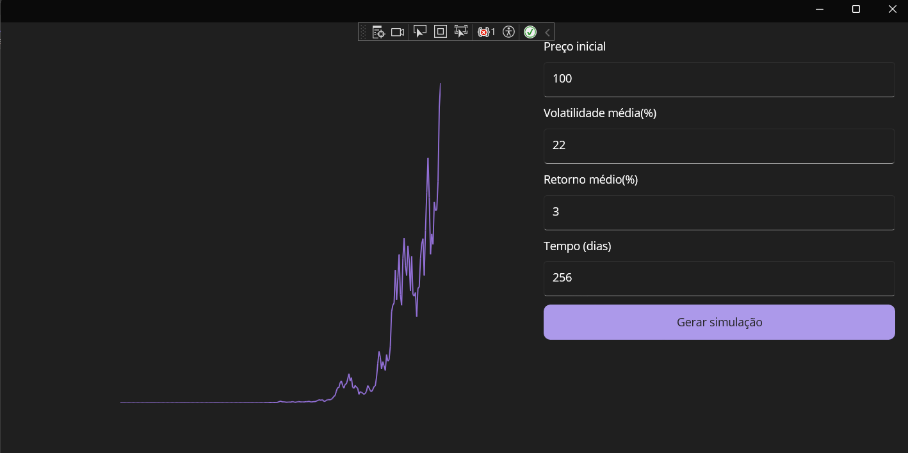

# BrownianApp - Simulação de Movimento Browniano

**BrownianApp** é uma aplicação desktop em **.NET MAUI 9** que simula o **movimento browniano**, um conceito utilizado em finanças para modelar o comportamento estocástico de preços.  
O projeto segue o padrão **MVVM** e permite visualizar graficamente trajetórias estocásticas de preços com base em parâmetros ajustáveis pelo usuário.

---

## 🖼️ Preview
  

---

## 🚀 Funcionalidades

- Inserção de parâmetros pelo usuário:
  - Preço inicial  
  - Volatilidade  
  - Média do retorno  
  - Tempo de simulação  
- Geração de gráficos dinâmicos utilizando **GraphicsView / IDrawable**    
- Layout responsivo e interativo  

---

## 🛠️ Tecnologias

- [.NET MAUI 9](https://learn.microsoft.com/dotnet/maui/what-is-maui)  
- Padrão **MVVM**  
- **GraphicsView / IDrawable** do .NET MAUI  

---

## ▶️ Como executar

1. Clone este repositório:  
   ```bash
   git clone  https://github.com/KaioViniciusMP/brownian-app-maui.git

  
